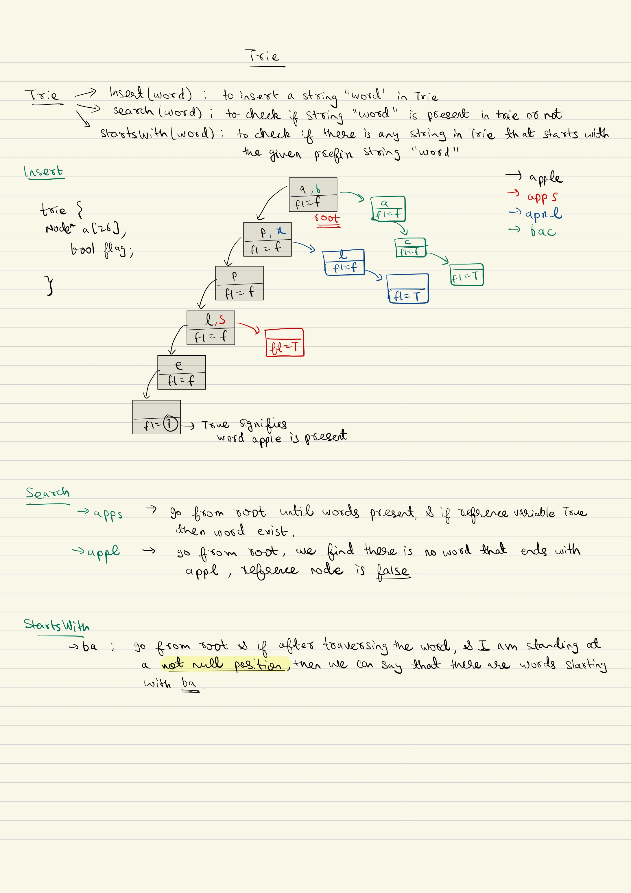

## Trie

Problem Link : [implement trie](https://www.naukri.com/code360/problems/implement-trie_631356?utm_source=youtube&utm_medium=affiliate&utm_campaign=striver_tries_videos&leftPanelTabValue=SUBMISSION)



```c++

struct Node {
    Node *links[26];
    bool flag = false;
    bool containsKey(char ch) {
        return (links[ch-'a']!=NULL);
    }

    void put(char ch, Node* node) {
        links[ch-'a'] = node;
    }

    Node* get(char ch) {
        return links[ch-'a'];
    }

    bool setEnd() {
        flag = true;
    }

    bool isEnd() {
        return flag;
    }
};


class Trie {
    private:
        Node* root;
    public:
        Trie() {
            root = new Node();
        }

        //tc: O(len)
        void insert(string word) {
            Node*  node = root;
            for(int i=0;i<word.length();i++) {
                if(!node->containsKey(word[i])) {
                    node->put(word[i], new Node());
                }

                //moves to the reference trie
                node = node->get(word[i]);
            }
            node->setEnd();
        }

        //tc: O(len)
        bool search(string word) {
            Node* node = root;
            for(int i=0;i<word.length();i++) {
                if(!node->containsKey(word[i])) {
                    return false;
                }
                node = node->get(word[i]);
            }
            return node->isEnd();
        }

        //tc: O(len)
        bool startsWith(string prefix) {
            Node* node = root;
            for(int i=0;i<prefix.length();i++) {
                if(!node->containsKey(prefix[i])) {
                    return false;
                }
                node = node->get(prefix[i]);
            }
            return true;
        }
 };


```