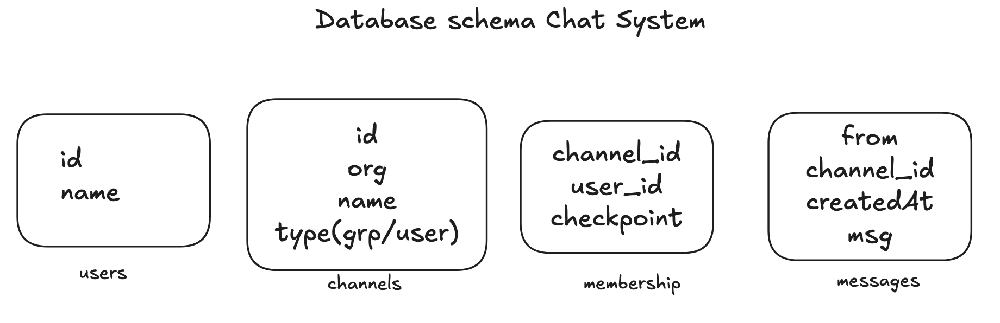
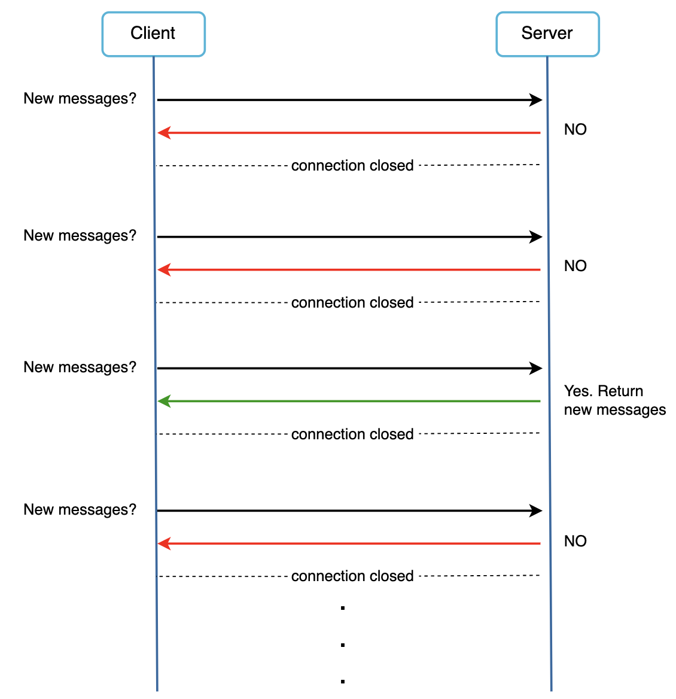
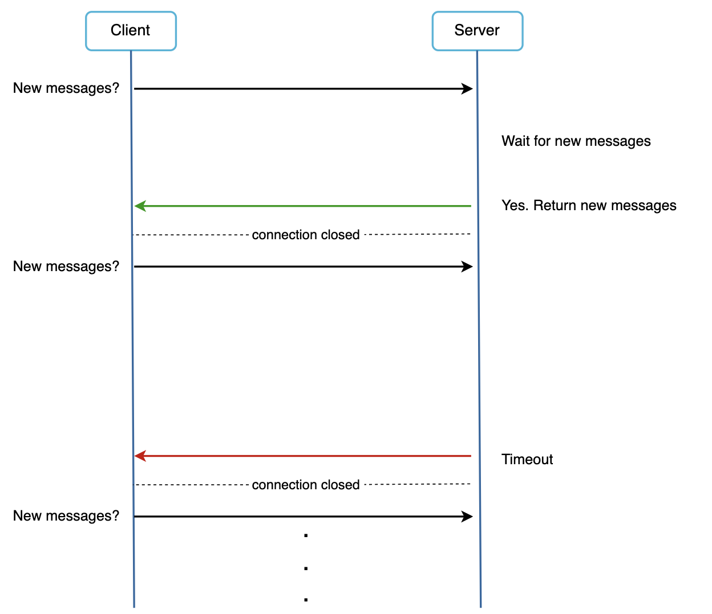
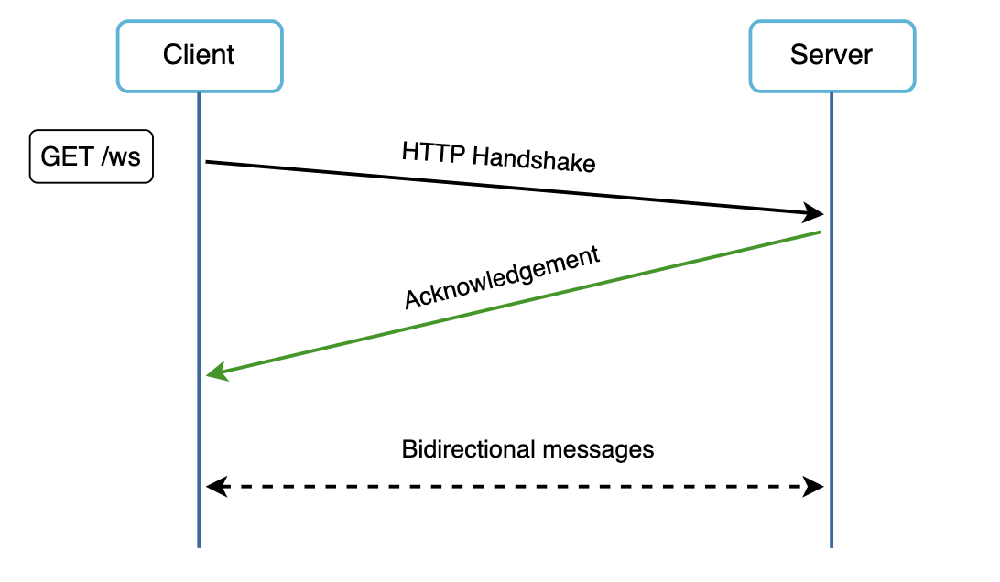
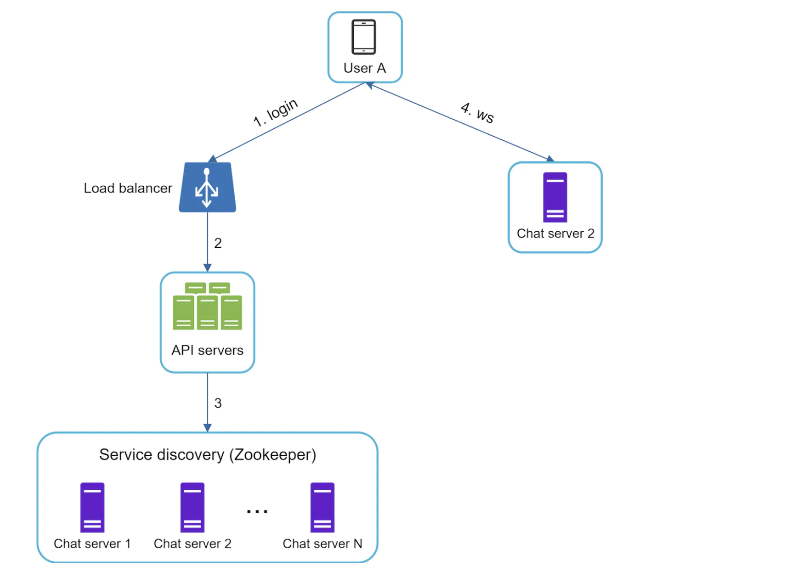
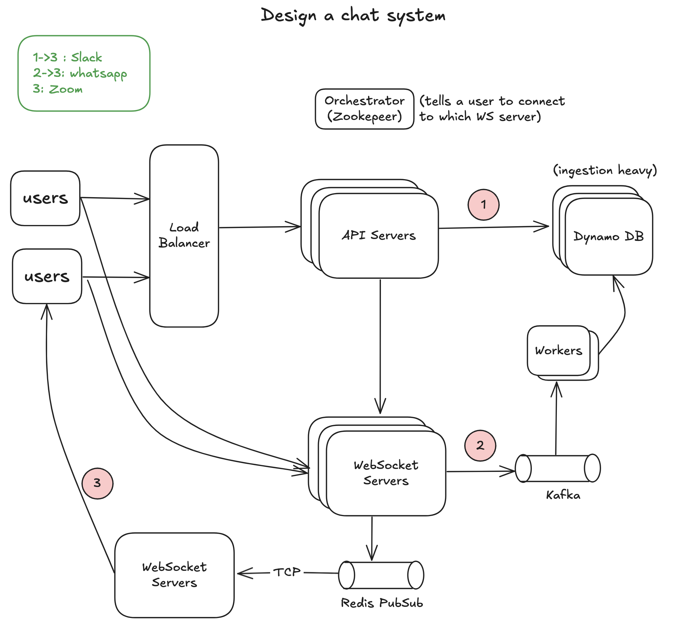

## design-a-chat-system

tags : short polling, long polling, websocket, zookeper, cassandra, kafka, redis pubsub

## Understanding the problem
Chat System allows user to send msg to other user in a group chat or 1-1.
It should support 50M DAU.

## Functional Requirements
- It shGould support both 1-1 and group chat. (roup should have 100 members limit)
- Historical Messages can be scrolled through.
- Online Indicator (Refer Arpit Bhayani Lec-1)
- Checkpoint

### Out of scope
- File attachments
- Encryption of message

## Non Functional Requirements
- Message should be delivered with minimal latency.
- Reliability : Message should not be dropped/lost
- Scalable

## Database Schema
- Whenever desiging schema , use nouns to name entity eg user_channel_table should be named as membership_table.
- So mapping in future can be expanded more than channel.
- We go with Cassandra DB here, as it is ingestion heavy (and goes well with Slack/Whatsapp).
- Relational databases do not handle long tail of data well. When the indexes grow large, random access is expensive.!

## Design Deep Dive
- HTTP is client initiated, it is not trivial to send messages from server, however many techniques are used to simulate a server intiated-connection. eg: short polling, long polling, websockets.

### Short polling
- The client periodically asks the server if there are messages availaible. Depending on polling frequency, polling could be costly. It could consume precious server resources to answer a question that offers o as answer most of the time.

### Long Polling
- In long polling, client holds the connection open until there are actually new messages availaible or timeout threshold has been reached. Once the client receives new msg, it immediately sends another request to server restarting the process.
- Drawbacks:
    - A server has no way to tell if client disconnected.
    - Server and receiver may not connect to the same server.
    - It's inefficient if user doesn't chat much, we see periodic connection after timeouts.

### Web-Sockets
- Is most common solution for sending asynchronous updates from server to client.
- It is intitated by client and could be "upgraded" via some well defined handshake to WebSocket connection.

## Deep Dive
- For HLD Diagram:
    - 1->3: Slack
    - 3->2: Whatsapp (We send msg through websocket & then async persist over to DB, by doing batch write.)
    - 3: Zoom

- When a user connects to WebSockets, it sends the metadata, to which all channels its part of.
- so ws1 has all membership details
    - Ws1 : A->C1, B->C1, C->C1, D->C1
- WS1 connects to WS2 using TCP connection.
- Now when A sends msg it is send to B, C, D and then goes to WS2 and sends to E, which is also in channel C1.

- Multipl TCP connections to diff web socket servers leads to connection wastage, which could be utilised to connect to diff users to deliver msg.
- Redis PubSub solves the problem of TCP overhead.
- Redis PubSub, does is it haves a mapping of WS1->Subscribes to Channel(C1), when WS1 connects to pubsub for first time.

### Edge Servers: 
- Because websockets are expensive and persistent tcp connections, browsers have a 6 concurrent tcp connection limit.

### Service Discovery
- role of service discovery is to recommend the best chat server for a client based on criteria like geoographical location. 
- Apache zookeper is a popular open source solution for service discovery.
- It registers all availaible chat servers and picks the best chat server for a client based on predefined criteria.

- Flow: 
    - User tries to login to app.
    - load balancer sends the login request to api server.
    - after backend server authenciates the user, service discovery finds the best ws server for user A. And server info is returned to user A.
    - User A connects to websocket server through websocket.

## Diagram

