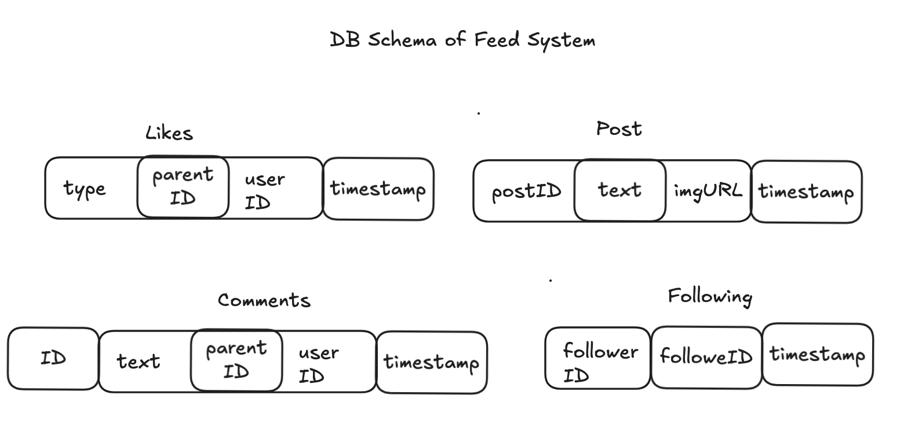
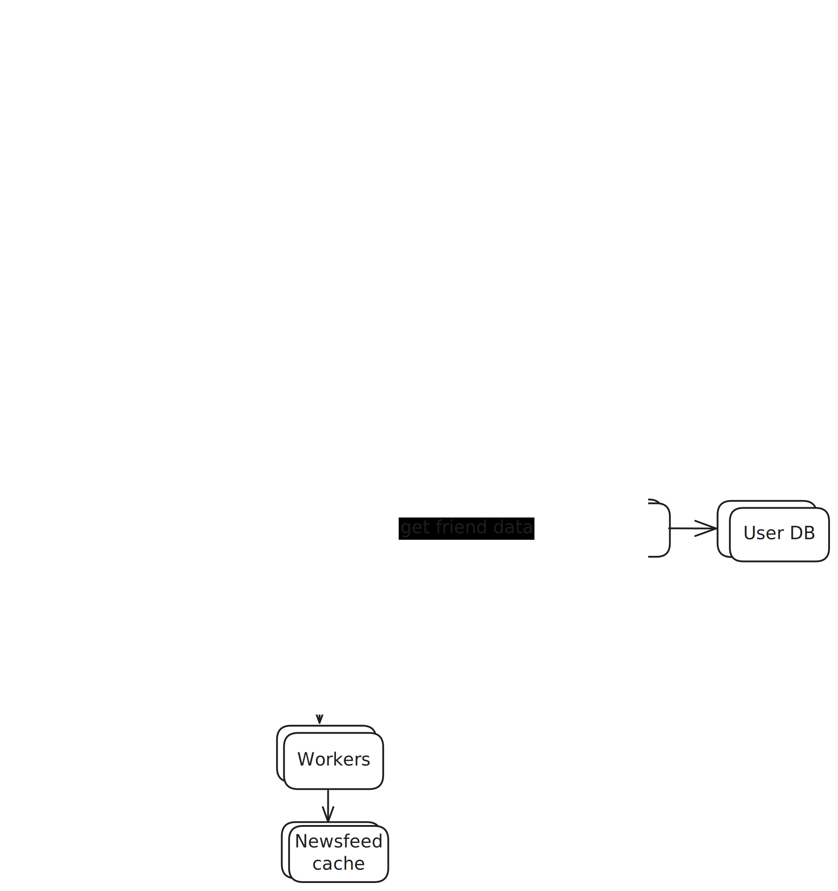

## design-a-news-feed-system

tags : 

## Understanding the problem
News feed is constantly updating list of stories in middle of your home page. News feed includes status updates, photos,
videos, links, app activity and likes from people, pages and groups that you follow on facebook.

## Functional Requirements
- User should be able to create posts.
- User should be able to view a feed of posts from people they follow, in chronological order.

### Out of scope
- User should be able to like and comment on posts.
- Posts can be private or have restricted visibility.

## Non Functional Requirements
- The system should be highly availaible (availability >> consistency)
- Posting and viewing feed should be fast (< 500ms)
- System should be scalable

## The APIs
- Feed Publishing API
    POST /v1/me/feed?content={content}&auth_token={auth_token}
    - auth_token: used to authenciate the request

- NewsFeed retrieval API
    GET /v1/me/feed
    - auth_token: used to authenciate the request

## DB Schema

## Design Deep Dive
### Feed publishing deep dive
- Fanout Service
    - Is the process of delivering post to all friends. 
    - Two types of fanout models are: fanout on write(push model) and fanout on read(pull model).

### Fanout on Write
- With this approach news feed is pre-computed during write time. A new post is delivered to friends'cache immediately after its published.

    Pros:
    - The news feed is generated in real-time and can be pushed to friends immediately.
    - Fetching news feed is fast because the news feed is pre-computed during write time.

    Cons:
    - If a user has many friends, fetching the friend list and generating news feeds for all of them are slow and time consuming. It is called hotkey problem.
    - For inactive users or those rarely log in, pre-computing news feeds waste computing resources.

### Fanout on Write
- News feed is generated during read time. This is an on-demand panel. Recent posts are pulled when user loads a home page.

    Pros:
    - For inactive users or those who rarely log in, fanout on read works better because it will not waste computing resources on them.
    
    Cons:
    - Fetching the news feed is slow as the news feed is not pre-computed.

- We adopt a hybrid approach to get benefits of both approach and avoid pitfalls in them. Since fetching news feed is crucial, we use push model for majority of users.
- For celebrities/models who have many followers, we let followers pull news content on demand to avoid system overload.
- Consistent hashing is a useful technique to migitate the hot-key problem

## Flow;
- Fetch friend IDs from graph DB.
- Get friends info from user cache.
- Send friends list and postId to message queue.
- Fanout workers fetch data from message queue and store news feed data in news feed cache.
- News feed cache <PostId, UserId>, we only store IDs to keep memory size small.

## Diagram

