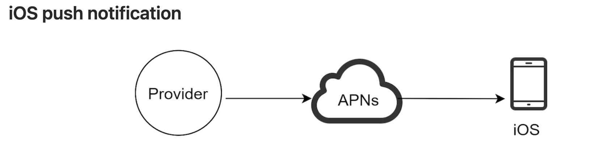
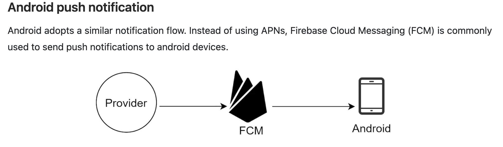
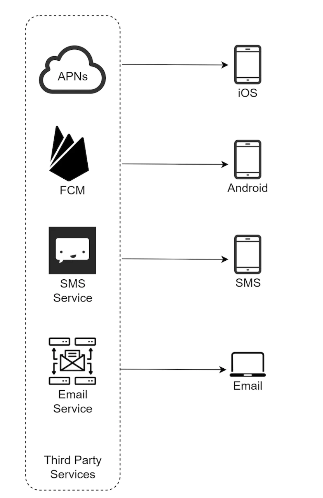
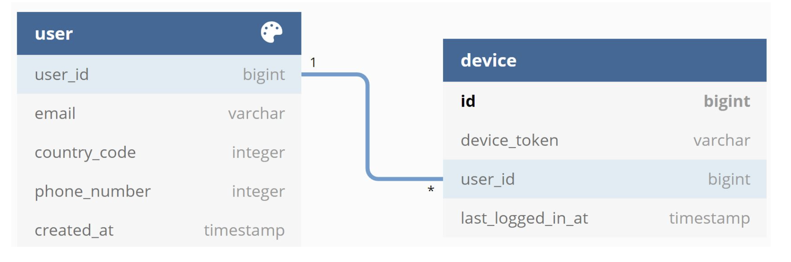
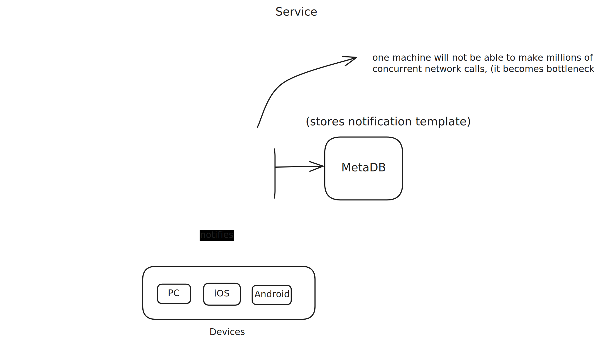
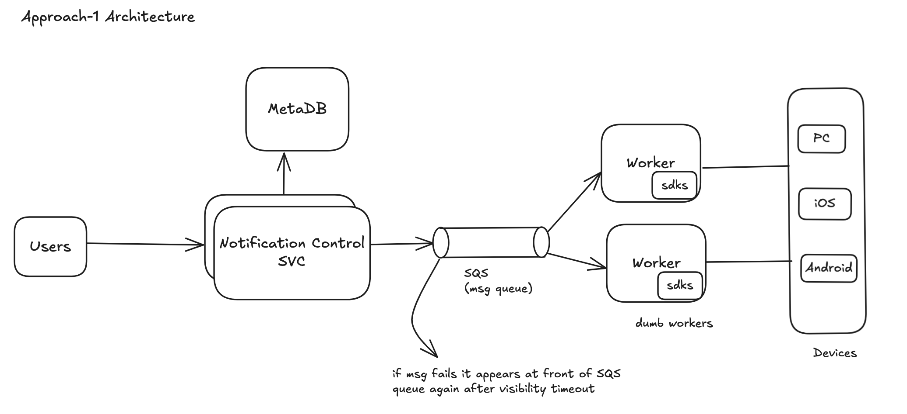
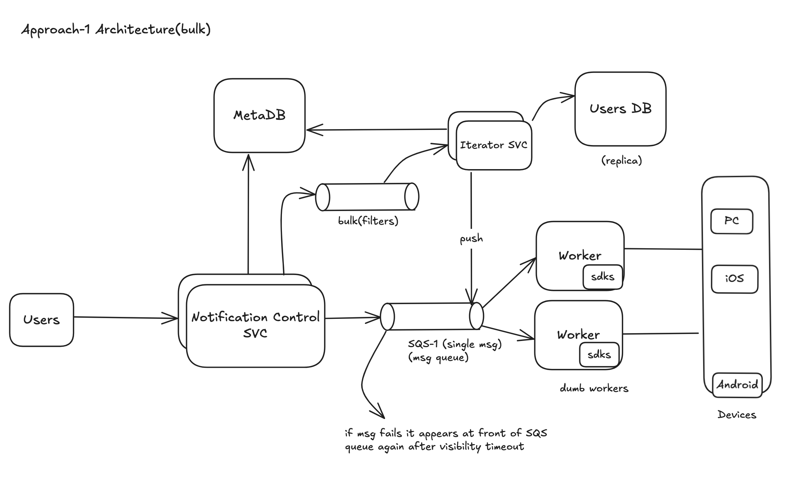
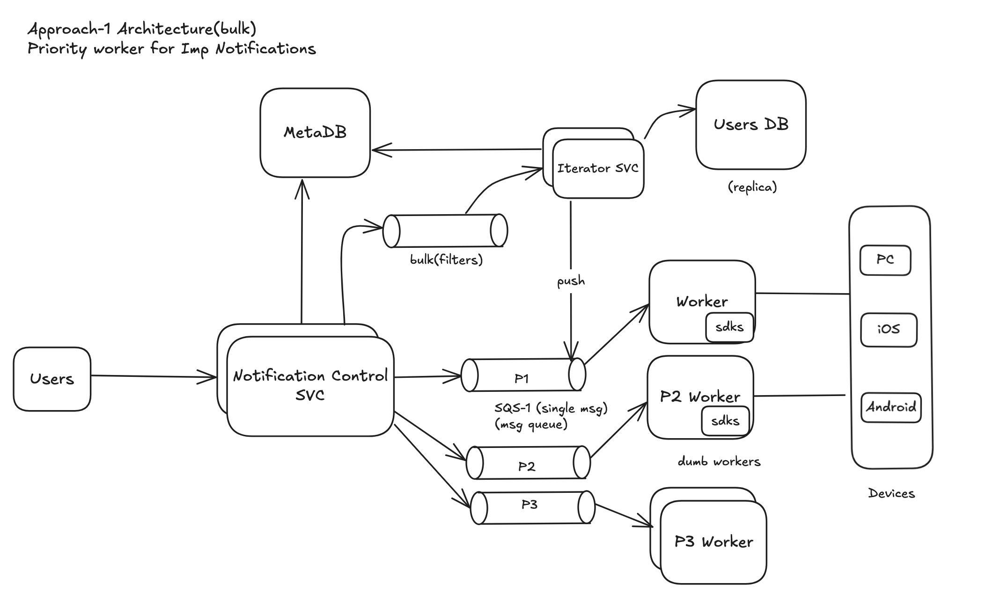
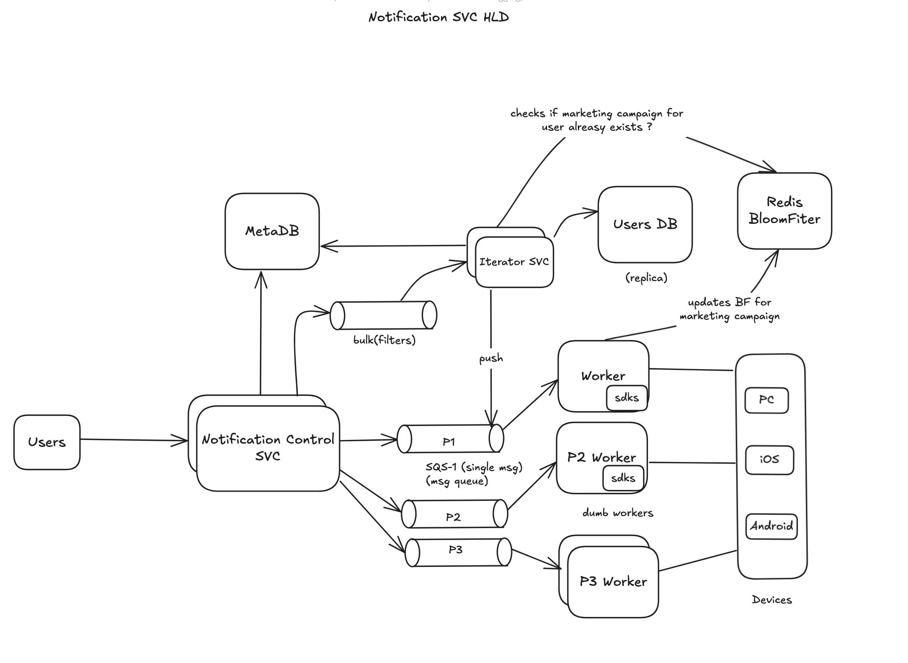

# design-a-notification-system

<p>tags : bloom filters, SQS(message queue)

## Understanding the problem

Design a notification service that sends notifications to users across channels. A notification alerts user with imp
information like breaking news, product updates, events, offerings etc.
The type of notification formats are : mobile push notifcation, SMS, and email.

## Different types of notifications

We primarily need three components to send and ios notifcation.

- Provider: A provider builds and sends notification requests to Apple Push Notification Services(APNs). To construct a push notification provider needs :
  - Device token: Unique identifier for sending push notification
  - Payload: JSON dictionary that contains payload
    ```js
        {
            "aps":{
                "alert":{
                    "title":"Game Request",
                    "body":"Bob wants to play chess",
                    "action-loc-key":"PLAY"
                },
                "badge":5
            }
        }
    ```
- APNs: this is a remote service provided by Apple to propogate notifications to iOS.
  
  
  

## Contact gathering flow

- To send notifcations we need to gather mobile device tokens, phone number or email address.
- When user installs or sign ups for the first time, API servers collect user contact info and stores in db.
  
- A user can have multiple devices, indicating that a push notification can be sent to all the user devices.

## Functional Requirements

- Should be able to send notifcation to users across different channels
- Should be able to configure notifcation template for sending notifications
  ## Follow up
    - Avoid sending duplicate notification (Bloom filters)

## Non Functional Requirements

- Should be highly scalable, able to support a high fanout
- Should be as realtime as possible
- Should be reliable(notifcation should not be lost/deleted)
- Notifications sent each day : 10 million mobile push notifications, 1 million SMS messages, and 5 million emails.

## The APIs

- example of the API to send an email
- POST: /api/v1/sms/send <br/>
  Request Body:

              {
                          "to":[
                              {
                                  "user_id":123456
                              }
                          ],
                          "from":{
                              "email":"from_address@example.com"
                          },
                          "subject":"Hello World!",
                          "content":[
                              {
                                  "type":"text/plain",
                                  "value":"Hello, World!"
                              }
                          ]
              }

## Design Deep Dive

### Approach 1:

- We need a UI & simple backend to create notification templates that will be configured by internal team.
- Number of notification template will not be huge and can fit into a single machine, so we start with relational DB.
- Users can be notified via multiple channels(email, sms, mobile push notification) , we invoke these programatically to send notification, so we have to configure their SDK/s and libraries.
  

- Triggering one notifcation for every user is pain for Product Manager
- Control svc becomes bottle-neck(network call takes time)
- This is our cue of making thing <b>asynchronous</b>, sending notification to thousands of users sync. is a bad idea.

### Approach 2:


- SQS offers reliablity if msg fails it appears at front of SQS queue again after visibility timeout.(Message queue remove dependencies between components. Message queues serve as buffers when high volumes of notifications are to be sent out.)<br/>
- Making it async prevents our notification control svc from hogging for retries and all continue sending notfication from other svcs.

## Support Bulk Notifcations

### Approach 1:
- We can have control service iterate over millons rows at a time,
- Challenge: It eats up control svc, whose responsibility is to accept notfication request

### Approach 2 (Better) :

  - Notification Control SVC delegates to iterator
  - The iterator iterates through users db and filters out on criteria, and pushes notification to SQS 1.
  - This way we decouple things and provide filter in bulk like send notification to Android device whose last logged in is 4 days ago.



### Some notifications are more imp than others.

- In our current arch one marketing campaign will keep executors busy and all other notifications will starve in queue.
- Sol: Instead of having one notification emitter queue have multiple priority queues(p1, p2, p3) & each having its own set of workers.
  

- horizontal scalability
- avoids starvation

  ### Avoid duplicate notifications :

  - To get a duplicate notification for same marketing campaign is ANNOYING !!
  - We can use <b>Bloom Filter</b> for marketing campaigns (Redis supports Bloom filters)
  - Bloom filter is a probablistic data structure, No means we definitely didn't send notification else yes (we might or might not have sent notification), this is ok since we don't care about absolute correctness.
  - We trade correctness of system with space efficiency.
  - The Iterator checks redis bloom filter for users and then based on if user exist don't send msg to SQS 1 else sends to it marketing campaign msg.

  - <b>BF.RESERVE {key} {error_rate} {capacity} [EXPANSION expansion] [NONSCALING]</br>
  ```code
    BF.RESERVE bikes:models 0.001 1000000
    OK
    > BF.ADD bikes:models "Smoky Mountain Striker"
    (integer) 1
    > BF.EXISTS bikes:models "Smoky Mountain Striker"
    (integer) 1
  ```

  - Refer final Arch Diagram

## Diagram


## Refs:
https://redis.io/docs/latest/develop/data-types/probabilistic/bloom-filter/