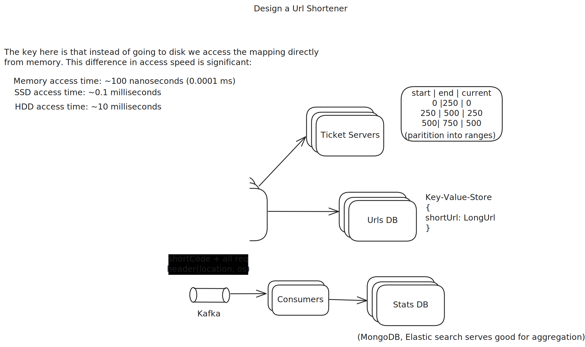

# design-a-url-shortener
<p>tags : bloom-filters

## Understanding the problem
Design a URL shortner that generates pseudo-random human readable short urls. Upon visiting takes you to original website.
Why ? Easy to share in sms.

## Back of the envelop estimation
- 100M DAU
- Short URL code to be as small as possible, we need this for 10 years atleast
- Write Operation : 100M urls generated daily
- Write Operation per second  = 100 * 10^6 / 10^5 = 1000 req/second.
- Consider Read:Write Ratio as 10: 1 => Read Operation = 10k req/second
- Storage: 100M urls * 365 days * 10 years * 100 (char for urls) = 100 * 10^6 * 10 * 100 * 365 = 365 * 10^11 = 36.5 Billion url = 36.5 TB

## Functional Requirements
### Core Requirements
- User should be able to submit a long URL and receive a shortened Version
- User should be able to access the long URL by using the shortened URL

### Out of scope
- no support for custom alias
- user authenciation and account management

## Non Functional Requirements
- The system should ensure uniqueness for short url (no two long urls can map to the same short url)
- The redirection should occur with minimal delay(<100 ms)
- The system should be reliable and availaible (99.99% of time i.e availaibility > consistency)
- Should be able to support 1Billion urls and 100M DAU.

## The APIs
- POST /api/v1/data/shorten?longUrl=${longUrl}
  Response : {shortUrl: "https://bit.ly/axCP451"}

- GET /api/v1/shortUrl
  Response: {longUrl: "https://github.com/nitiinkk5/dsa-algo/new/main/hld"} for redirection

  ### 301 vs 302
  - 301 : Since it is permanently redirected, the browser caches the response, and subsequent requests for
    the same URL will not be sent to the URL shortening service. Instead, requests are redirected to the long URL server directly.
      - Good for reducing server load.
  - 302 : URL is “temporarily” moved to the long URL, meaning that subsequent requests for the same URL will be sent to the URL shortening service first.
    Then, they are redirected to the long URL server.
      - Good for analytics use case.

## Design Deep Dive
### How to shorten a URL ?
1) Approach 1: Hash the URL
  -  SHA-256 are 256 bits long  = 32B
  -  32B short urls are not short, two urls can have same hash.
2) Approach 2: IntegerId as short
  - if url is stored in DB and is at ID : 1729 then bit.ly/1729
  - very short but predictable
  - someone can easily scrape all shortened urls
3) Approach 3: Custom encoding
    - Total unique characters in url = (0-9) + (a-z) + (A-z) = 62 characters = 2^6
    - We define the map that maps each of 6bits to a character
        - 000000 -> a
        - 000001 -> b
    - say our DB gave id as 79
    - we convert 79 to binary number and pad the value until it becomes multiple of 6  => 000001(b) 001111(p) => bp
    - short url = bit.ly/bp
    - But its still predictable, so what can we do ??
    - so crux of the problem is to <b>pick random IDs</b> instead of picking sequential IDs

## How is short code/url generated ?
   - if we go sequentially for IDs, easy to predict the next one
   - only one machine should not be handling this (too much load on one machine)
   - we set up a few db servers having a job to issue one random integers(unique, atomically) (eg: we could use something like redis as a global counter)(atomic operation)
   - <b> Ticket Servers </b>
     - On a smaller scale say to 0 to 1000 say we partition into 4 ranges
```table
    | start | End   | current |
    |-------|-------|---------|
    |  0    |  250  | 0       |
    |  250  |  500  | 250     |
    |  500  |  750  | 550     |
    |  750  |  1000 | 750     |
```
- user wants short url
- api server picks ticket server -> server knows availaible range
- api server picks one range at random
```sql
BEGIN
select * from ranges where id = ?;
update ranges set current = current + 1 where id =  ?;
COMMIT
```
- api server selects the 'current' of the range
- increments current by 1 if end!=current
- because we are picking one random range, we see a pseudorandom order. within range the order is sequential
- we then encode for the random id and store mapping of short url and original urls in db.
  

  ## Storage
    - We store mapping b/w short url and actual url in database
    - Schema : short_code | url
                bpqdpq    |  https://
                ajdcbs    |  https://
    - given our <b> access pattern is jus kv based </b> we can store these in any KV store.
    - Amt of data per month = 100M * (8 + 120)(short_code + url)
                            = 128 * 100M  = 128*10^8 = 12.8 GB
    - Storage is not the concern, we can shard the load.
    - we can take max ids we would support say 4 Billion(2^32), at 100M per month consumption, it could take 40 months ~=3 years to exhaust the range.
    - if we want to support more, we increase int to 64 bits, 2^64 = 1.84*10^19/(100*10^6) = 15 Billion years
    - 64 bits ~= 11 char(encoded)
    - But if we want to reduce the <b>short code length</b> just reduce the bit, instead of starting from 0, lets do it from 100000 to have short code of length at least 3.
    - say we want short code min length = 3 and max length = 8
      - minLen = 3 = 3 char = 3 * 6 = 18 bits = 2^18 ~= 100,000 with pad zero
      - maxLen = 8 = 8 char = 8 * 6 = 48 bits = 2^48 = 5.62 * 10^4 (max value)

    - say we want each range to exhaust in 1 year, so it generates 100M *12 = 1200M urls = 1.2*10^9 urls
    - Total ranges = (5.62*10^14)/(1.2*10^9) = 4.5*10^5 ranges
    - Now we have a 500k ranges
        100K to 1200M
        1200M to 2400M
        2400M to 3600M
    - We spin a new DB and move some ranges there if DB becomes bottleneck. Now API server will pick one ticket server at random.
    

## Diagram
