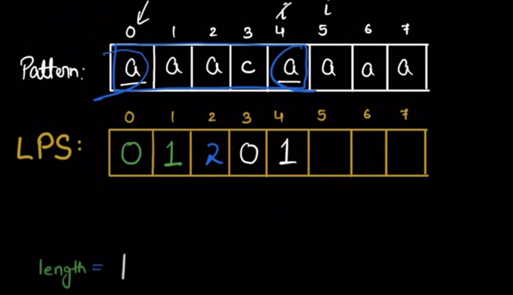

## Knuth Morris Pattern | String Matching Algorithm

- Ref : https://www.youtube.com/watch?v=qases-9gOpk


### Without KMP Algo
```
txt = "ABABCABCABABABD"
pattern = "ABABD"
```

- this naive approach takes TC : O(m * n), KMP pattern helps us to optimise the TC
- in naive approach when the txt string doesn't match with pattern string the idx for pattern string is restarted.


### KMP Approach
- LPS[j] = (0 to j) : longest prefix suffix equal length
- LPS[0] = 0 (as its the same character, if you see pattern string then LPS[0] = 0, as "A" (pattern[0], doesn't have suffix and prefix))
- LPS[1] = 0 (for string AB, no prefix = to suffix)
- LPS[2] = 1 ( as in string ABA => prefix A equals suffix A)


### Writing LPS Code:


### Code of LPS
```
LPS[0] = 0;
length = 0;
i = 1;
while(i < m) {
    if(pattern[i] == pattern[length]) {
        length++;
        LPS[i] = length;
        i++;
    } else {
        //if pattern don;t match then update length = LPS[length-1]
        if(length!=0) {
            length = LPS[length-1];
        } else {
            LPS[i] = 0;
            i++;
        }
    }
}

```

### KMP Code
- adv of LPS is to not send j back entirely
- TC : O(M+N), SC: O(M) where M is length of pattern, N is length of string txt
```
class Solution {
    public:
        void computeLPS(string pattern, vector<int>&lps) {
            int M = pattern.length();
            int len = 0;
            lps[0] = 0; // Because there is no proper suffix and prefix of pattern[0..0]

            int i = 1;
            while(i < M) {
                if(pattern[i] == pattern[len]) {
                    len++;
                    lps[i] = len;
                    i++;
                } else {
                    if(len!=0) {
                        len = lps[len-1];
                    } else {
                        lps[i] = 0;
                        i++;
                    }
                }
            }

        }

    vector<int>search(string pat, string txt) {
        int N = pat.length();
        int M = txt.length();
        vector<int>result;

        //longest prefix suffix
        vector<int>lps(M, 0);
        computeLPS(pat, lps);

        int i = 0;
        int j = 0;

        while(i<N) {
            if(pat[j] == txt[i]) {
                i++;
                j++;
            }

            if(j == M) {         //found the pattern
                result.push_back(i-j); //for 1 based indexing result.push_back(i-j+1)
                j = lps[j-1]; //to find other idx of pattern matching we move j back to lps[j-1]
            } else if(i < N && pat[j]!=txt[i]) {
                if(j != 0) {
                    j = lps[j-1];
                } else {
                    i++;
                }
            }
        }
        return result;
    }
}

```